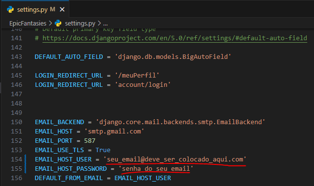

# EpicFantasies

Este projeto faz parte do Projeto Integrador Transdisciplinar em Ciência da Computação II.

Uma rede social para publicação de historias que os usuarios podem navegar, ler e se aventurar.


## Funcionalidades
 - Criar histórias
 - Comentar
 - Reagir
 - Compartilhar

## Tecnologias Usadas
 - Python 
 - Django Framework
 - Gunicorn
 - Nginx


## Instalação
INSTALANDO MYSQL

```bash
sudo apt update
sudo apt upgrade -y
sudo apt install mysql-server -y
sudo systemctl status mysql
sudo systemctl start mysql
sudo mysql_secure_installation
```

Pode configurar o usuario root como desejar

Verificando se funcionou e já criando tabela e usuário para o projeto

```bash
sudo mysql -u root -p
```

```sql
CREATE DATABASE epicfantasiesDataBase;
CREATE USER 'SEU_USUARIO'@'localhost' IDENTIFIED BY 'SUA_SENHA_AQUI';
GRANT ALL PRIVILEGES ON epicfantasiesDataBase.* TO 'SEU_USUARIO'@'localhost';
FLUSH PRIVILEGES;
EXIT;
```
CLONANDO REPOSITORIO

```bash
git clone https://github.com/AndersonNey/PIT2_EpicFantasies.git
cd ./PIT2_EpicFantasies
```

PREPARANDO PROJETO LOCAL
```bash
sudo apt update
sudo apt install python3 python3-venv python3-pip -y
python3 -m venv venv
source venv/bin/activate
pip install -r requirements.txt
```
CONFIGURANDO PROJETO
```bash
python manage.py makemigrations
python manage.py migrate
python manage.py makemigrations epicfantasiesapp
python manage.py migrate epicfantasiesapp
python manage.py createsuperuser
```
Após criar super usuario

Vá no arquivo EpicFntasies/settings.py e insira o email e a senha de e-mail que ficará responsavel por enviar o e-mail de confirmação para os usuários.



Após isso execute:

```bash
python manage.py runserver
```
Por padrao o Django é executaddo na porta 8000
```bash
http://127.0.0.1:8000/
```
Após ver se ele executou corretamente é necessario criar uma categoria na pagina administrativa do Django para isso acesse:
http://127.0.0.1:8000/admin e insira as credenciais de super usuário encontre a tabela de categorias a esquerda e crie pelo menos uma, pronto já vai está tudo configurando e pronto para funcionar.

## Contato

- Anderson Ney
- andersonney@outlook.com.br